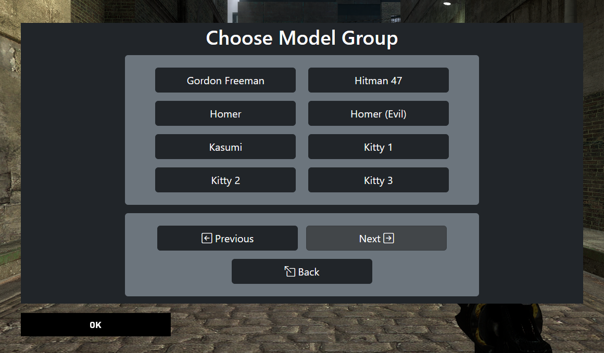
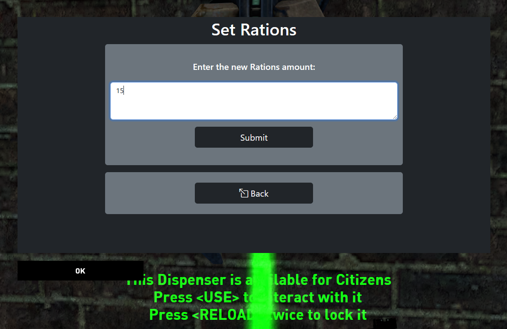

# MOTDDialogBuilder
Builds generic web-rendered representations of mod's networked plugin dialogs

## Introduction

A simple web module which allows presenting players with Dialogs in MOTD panel, mostly analogous to the basic networked/plugin ones present in Source Multiplayer. The main goal/benefit of the module is to avoid modern issues with these already limited Dialogs, while improving UX in its own ways. The motivating issues on these VGUI "plugin" Dialogs are the following:

1. `cl_showpluginmessages` CVar being disabled by default since a 2018 update
2. Rendering issues that arose since the HL2 Anniversary Update. In particular, the new "auto-scaling" system breaks menu items text, which gets cut at the button borders. Also, the accompanying extra text (used for hints/descriptions) for some Dialog types just doesn't show.

However, this module is not sufficient for the web Dialogs to work. The corresponding game mod/plugin has to communicate bidirectionally with the module in a compatible way, so as the HL2RP mod core does.

## Other key benefits

1. Generic composition. The module doesn't use concrete layouts for the particular mod's Dialog classes. It simply renders the common structure in the same way for each basic type of Dialog (e.g. Menu, Entrybox, etc.), corresponding to the ones supported by the native "plugin" Dialogs.
2. As opposed to the default Dialogs, which allow 8 items at max. in menus, this module allows showing 8 custom items per page specific to the current menu, but handling navigation buttons separately (Previous/Next/Back), making a total of 11 visible items at maximum.
3. As opposed to the default Dialogs, the 'Back' button can also appear in Entryboxes (when these have a parent in the current Dialog stack). In general, it's supported within any type of Dialog.

## Architecture

The main flows, along with the involved components that make MOTD Dialogs possible, are the following. Each component (along optional taken action) is styled in bold, while the exchanged messages are in italics:

1. Initial load:

	**Game Server** → _Query URL_ → **Client (MOTD load)** → _Query URL_ → **PHP bridge** → _Query command_ → **RCON/Server (Dialog query)** → _Dialog response (JSON)_ → **PHP bridge (layout build)** → **Client (MOTD render)**

2. Live usage:

	**Client (Dialog interaction)** → _Async command_ → **PHP bridge** → _Secure command_ → **RCON/Server (command handling)** → _Dialog update (JSON)_ → **Client (MOTD refresh)**

## Installation

Simply upload the root folder to a webserver directory of your preference, and create `cfg/motd_dialog_cfg.ini` as mentioned in the sample file (with your own config). You'll also need to set the CVar `sv_dialog_motdforward_url` from your game server with the URL pointing to the uploaded `motd_dialog_builder.php` file.

Additionally, you can see sample HTML Dialogs showcasing the same design than in-game ones by accessing the `*_sample.html` files at the `samples` subfolder from your webserver.

## Sample screenshots

Model Menu:

Dispenser Rations Entrybox:

## Known issues

There has only been detected an issue where first-time MOTD window activations randomly come with visual effects delays. For instance, menu items get highlighted late after hovering with the mouse, or text selection as well. It has happened to me randomly about 50% off initial MOTD activations. However, when the issue doesn't trigger, the effects render instantly for the entire MOTD "session".
